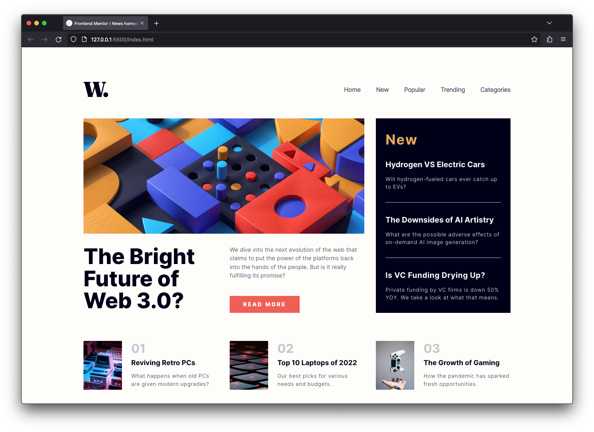
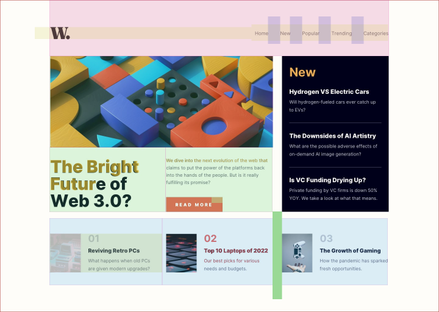

# Frontend Mentor - News homepage solution

This is a solution to the [News homepage challenge on Frontend Mentor](https://www.frontendmentor.io/challenges/news-homepage-H6SWTa1MFl). Frontend Mentor challenges help you improve your coding skills by building realistic projects. 

## Table of contents

- [Overview](#overview)
  - [The challenge](#the-challenge)
  - [Screenshot](#screenshot)
  - [Links](#links)
- [My process](#my-process)
  - [Built with](#built-with)
  - [What I learned](#what-i-learned)
  - [Continued development](#continued-development)
  - [Useful resources](#useful-resources)
- [Author](#author)
- [Acknowledgments](#acknowledgments)

**Note: Delete this note and update the table of contents based on what sections you keep.**

## Overview

### The challenge

Users should be able to:

- View the optimal layout for the interface depending on their device's screen size
- See hover and focus states for all interactive elements on the page

### Screenshot



### Links

- [Solution URL](https://github.com/ahzorek/FrontendMentor-News_homepage)
- [Live Site URL](https://superlative-tanuki-87d05b.netlify.app/)

## My process

### Built with

- Semantic HTML5 markup
- CSS Grid
- Flexbox
- [Tailwind](https://tailwindcss.com/) - CSS utility-classes framework

### What I learned

Okay, so my goal for this, which is my second project here on Frontend Mentor, was to recreate the layout as closely as possible (down to the pixel) using Tailwind. I've just started learning Tailwind and I'm still in that phase of becoming familiar with its syntax and all, but I'm quickly understanding why it receives so much love. However, in order to match this layout as closely as possible to the source, I made extensive use of arbitrary values, which I'm aware is not a good (or at least, preferable) Tailwind practice. Another thing, as my setup here was a simple vanilla HTML+CSS+JS, I used Tailwind through its CDN script, which I'm also aware is not designed for prod and excludes all the performance optimization aspects of Tailwind. But as I mentioned, my focus here was on the dx side of things.
Also, lots of Figma slicing:




```html
  <main class="grid md:grid-cols-3 gap-[30px] mb-10">
    <section class="md:col-span-2 grid md:grid-cols-2 gap-[30px]">
      <div class="md:col-span-2">
        <picture>
```

### Continued development

Continuing with this project, or when designing it for production in general, my focus would not be on achieving pixel-perfect alignment, but rather on creating a natural flow in the layout using proper Tailwind values. I might also explore different project setups, such as using Astro, where having full control of Tailwind configs, I can tailor it to better suit the needs of the project. Accessibility is another aspect I'd likely revisit, giving it more thought. These are the points I plan to address in my upcoming projects as well.

### Useful resources

- [Tailwind doc](https://tailwindcss.com/) - Well, lets just say I pressed CMD+K *a few times*.
- [CSS Tailwind Converte](https://tailwind-converter.netlify.app/) - I didn't use it as much as I used to, but it's still a super cool and handy little project that helped me a bunch when I was getting into Tailwind. So, I figured, why not share the link?

## Author

- Website - [Andre Z](https://github.com/ahzorek)
- Frontend Mentor - [@ahzorek](https://www.frontendmentor.io/profile/ahzorek)

## Acknowledgments

[Kevin Powell](https://www.kevinpowell.co/), whose teaching skills are only matched by his attitude and general positivity. Let's keep making every corner of the web just a little more awesome.
